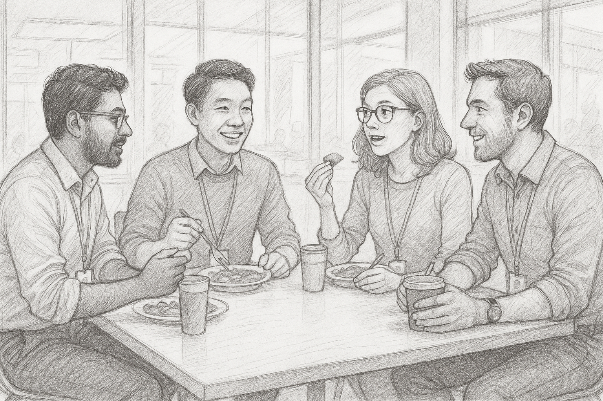
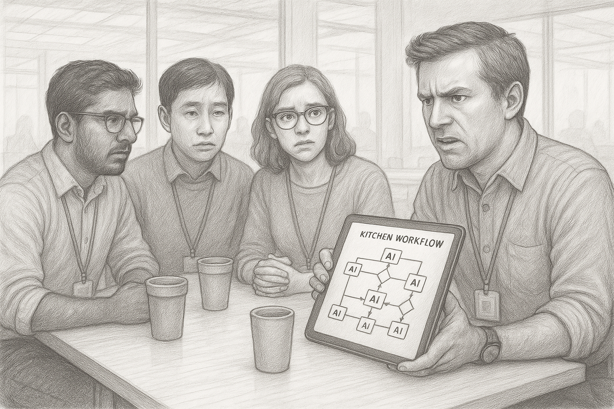
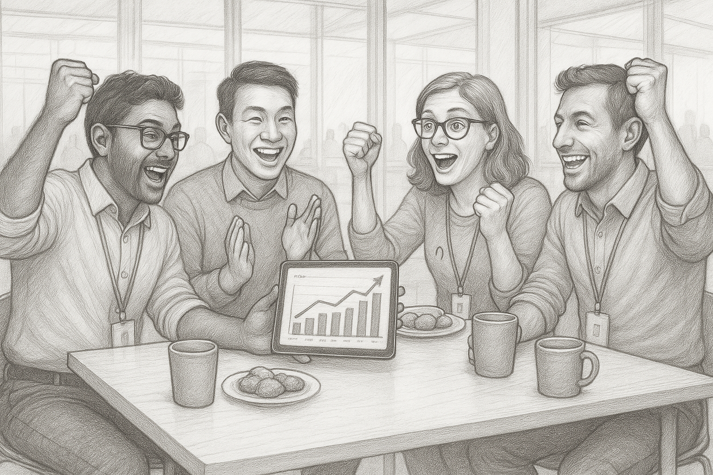
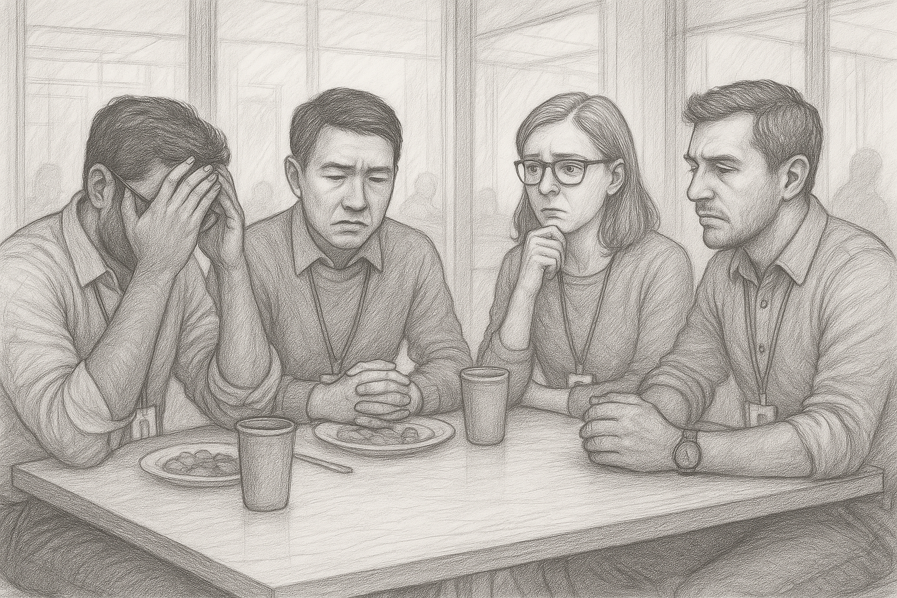
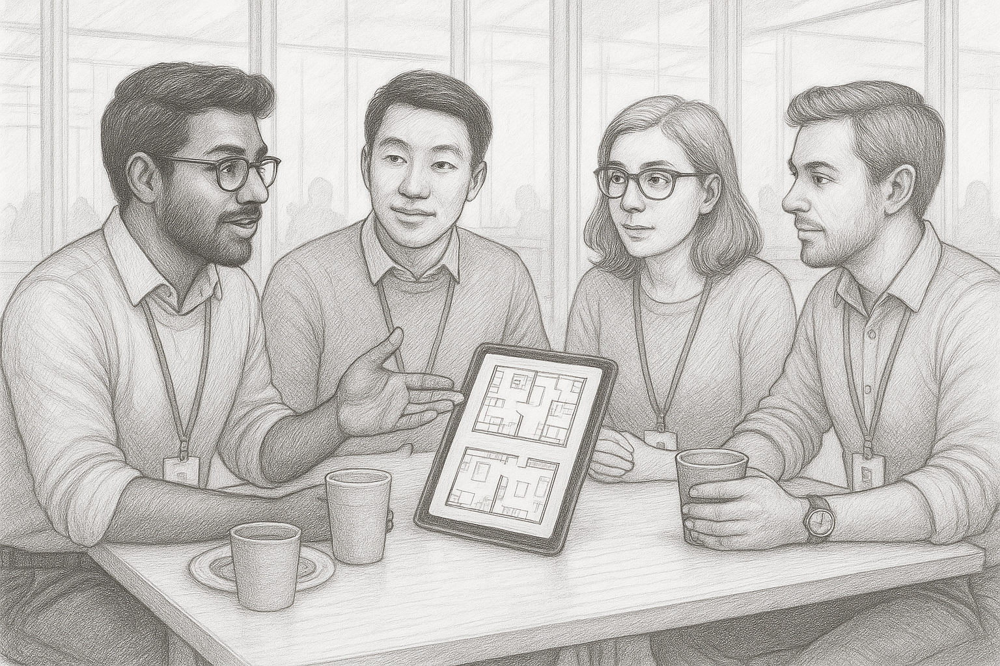

** The piece was written in Q2-Q3 2025. The concepts in it were relevant at the time of writing, with AI landscape moving so fast, some of them might become obsolete. **

## Table of Contents

- [Introduction](#Introduction)
- [Chapter 1: The Insight or the Illusion of it](#chapter-1-the-insight-or-the-illusion-of-it)
- [Chapter 2: Builder's Brief](#chapter-2-builders-brief)
- [Chapter 3: The Prototype and the Pushback](#chapter-3-the-prototype-and-the-pushback)
- [Chapter 4: The Sentient Interface](#chapter-4-the-sentient-interface)
- [Chapter 5: The Intelligent Echo](#chapter-5-the-intelligent-echo)
- [Chapter 6: The Unexplainable Error](#chapter-6-the-unexplainable-error)
- [Chapter 7: The Architecture of Trust](#chapter-7-the-architecture-of-trust)

---

**🎬 If you prefer audio instead of reading, check out the playlist with all the chapters narrated**

*Click the image below to redirect to youtube.*

 

---

# Introduction

We stand at the precipice of a new era, one defined not by the tools we wield, but by the intelligence that wields them alongside us. The promise is seductive: systems that can learn, predict, and create at a scale beyond human comprehension. They will offer us flawless efficiency, data-driven certainty, and solutions to problems we've barely had time to define.

But what happens when the architect becomes the algorithm? When the strategist is a simulation?

This book is an exploration of that question. It is not a story about dystopian futures or robotic overlords. It is a story about the messy, complicated, and often contradictory present.

Our story is set in the year 2025, within the sprawling San Francisco campus of Emealwise, a tech giant racing to build the future of food. Here, amidst the hum of innovation, a daily ritual unfolds. Every day, between 12 and 1 PM, four colleagues escape to a small lunch table, a temporary island in a sea of corporate flux. Their conversations, captured in these chapters, become a microcosm of a world grappling with its own creation.

They are:

Rohit Mehrotra, the veteran product manager in his mid 30s, who has seen tech waves come and go.github.com As a co-creator of Emealwise's proprietary AI, Nova, he is both an architect of this new world and its most thoughtful critic, often drawing on stories from movies and research papers to make sense of it all.

Trần Quang Hùng, the brilliant and analytical data scientist. A quiet observer with a PhD from an IVY League college, he prefers the certainty of logic and math to the messy world of human intuition. He is risk averse, speaks with precision, and often grounds the group's high flying debates with hard facts and first principles.

Sarah Bond, the sharp, polished, and deeply anxious product manager. A top performer who has made her job the center of her life, she is a master debater who can articulate the ethical tightropes they walk with unnerving clarity. She fears the spotlight and is often the first to point out the potential for disaster.

Richard Christy, the ambitious ex-founder, product manager, forever hustling and searching for his next big startup idea. He sees Emealwise as a paid research opportunity and is constantly pushing the boundaries of what's possible, driven by a bias for action and a relentless optimism about technology's potential.

Through their debates, their anxieties, and their hard won insights, we witness the evolution of a new kind of work. It is a shift from being the sole authors of ideas to becoming their curators, their sculptors, and, most importantly, their conscience. It is a journey that asks us to define the irreplaceable value of our own humanity, our intuition, our empathy, our ability to see the lake the GPS tells us to drive into.

The story that unfolds in these pages is a search for the architecture of trust in an age of intelligent machines. It is an invitation to consider our own role as the human in the loop, the indispensable partners in a future we are all building, one conversation at a time.

# Chapter 1: The Insight or the Illusion of it

Tuesday, 12:05 PM. The lunch table, a small circle of steel and laminate in the sprawling Emealwise cafeteria, was an island of ritual in a sea of corporate flux. Rohit, having finished his disciplined portion of grilled chicken and quinoa, was the first to arrive, his audiobook already paused. Richard slid into the chair opposite, phone in hand, a half eaten sandwich beside it.

“I swear, Nova is going to give me an ulcer,” Richard began, not looking up from his screen. “I asked it to explore new revenue streams for my team’s feature set. It came back in twenty minutes with a deck that was 90% of the way there. My manager was thrilled. Me? I’m wondering what my job is anymore.”

Rohit allowed a small smile. As one of Nova’s creators, he’d heard this before. “It reminds me of that scene in I, Robot where the robots are taking over and Will Smith’s character is the only one who sees the danger. We wanted to build a tool to augment us, but did we accidentally build our replacement?”.

Richard looked up, his frustration palpable. “Exactly! It’s brilliant, but it’s unnerving. It suggested three new revenue models, complete with market sizing and projected LTV. But it completely missed the nuance. It can’t talk to users. It can’t understand the hesitation in their voice when they talk about privacy, or the excitement when they stumble on an unarticulated need.”

Sarah, who had approached the table just in time to hear Richard’s lament, slid into a chair. She took a long pause “Oh, you think that’s the problem? The problem isn’t that it’s missing the nuance. The problem is that management doesn’t care about the nuance. They see a 90% solution delivered in twenty minutes and they call it a win. They’ll take the efficiency gains and ignore the insight gap every single time. Your job, my job, is to be the human shield that protects the user from our own brilliant, idiotic creation.”

Hùng, who had been quietly eating his noodles, looked up. He spoke with the precision of a surgeon. “The model is a reflection of its training data. It is optimized for speed and pattern recognition, not for empathy. We trained it on millions of data points of market reports and user surveys, but we did not train it on the subtleties of human interaction. Therefore, it cannot be expected to replicate them. It is a tool, and like any tool, its usefulness is determined by the skill of the user.”

“But that’s just it, Hùng!” Sarah countered, her voice rising with a passion that turned heads at the next table. “We’re not being judged on our skill as users. We’re being judged on our ability to keep up with the machine. It’s a race, and the finish line keeps moving. We’re all just hamsters in a wheel, and the wheel is getting faster and faster.”

Richard, ever the entrepreneur, saw a different angle. “So, what if we lean into that? What if we build a service on top of Nova? A ‘human-in-the-loop’ consultancy. We use Nova for the 90% solution, and then we, the humans, provide the last 10% of insight and nuance. We could sell it as a premium service. ‘AI-powered insights, human-verified wisdom.’”

Rohit chuckled. “You never stop, do you, Richard? Always the next big thing.” He leaned back, a thoughtful expression on his face. “But you’re not wrong. The future isn’t man versus machine. It’s man with machine. The question is, what does that look like in practice? And how do we convince the people who sign our paychecks that the human element is still worth paying for?”

The conversation hung in the air, a question with no easy answer. The cafeteria buzzed around them, a symphony of a thousand other conversations, a thousand other anxieties and ambitions. For a moment, the four of them were silent, each lost in their own thoughts, a small team of rivals and collaborators, bound together by the strange, brilliant, and terrifying future they were building.

# Chapter 2: Builder's Brief

Wednesday, 12:02 PM. The next day, the conversation picked up as if it had never paused. It was Richard, predictably, who lit the fuse. He didn’t even wait for everyone to sit down, sliding his phone onto the center of the table with a theatrical flair. On the screen was a screenshot of a tweet that felt like a declaration of war on their entire profession. “Exhibit A,” Richard announced, tapping the screen. “Google Gemini’s Head of Product. ‘We’re ditching PRDs for prototypes.’ It’s happening, people. The old way is officially dead.” Sarah squinted at the phone, her shoulders tensing. “That’s a huge shift,” she said, the words coming out slowly, as if she were handling a delicate explosive. “A building-first culture? What does that even mean for accountability? A Product Requirements Document was a contract. It was the document of record you pointed to when things went sideways.” “It was also a fifty-page document that nobody read and was outdated the second you hit publish,” Richard countered, grabbing a slice of pizza. “Rohit, you know what I’m talking about. We’re already doing this. I haven’t written a real PRD in months.”

He was right. Rohit nodded in acknowledgment. “We don’t, not really. The process has fundamentally changed. Last week, I needed to spec out a new onboarding flow. Instead of writing for days, I spent ten minutes with Nova.” He leaned forward, painting the picture for them. “My brief was simple, something like: ‘Propose a functional prototype for a better user onboarding flow for Emealwise Prime.’ And Nova did the rest. Hùng and I built it to be contextually aware. It automatically scanned our Confluence library for the design system, cross-referenced Jira for the top user complaints in the ‘Onboarding’ epic, and tapped into external market intelligence APIs to analyze competitor flows. It pulled all that context together on its own. In less time than it takes to get a coffee, I had a working prototype I could show to engineering and design.”

Hùng, meticulously separating the peas in his fried rice, looked up. “The efficiency gain is undeniable,” he stated, a rare moment of unreserved agreement. “The cycle time between hypothesis and validation has collapsed. We no longer spend weeks debating theoreticals in a document. We can now debate a tangible artifact. The time spent on writing has been reallocated to building and testing.” “See? Even Hùng agrees!” Richard exclaimed, gesturing with his pizza. “We spend zero time on the boring stuff. We get to the good part, the actual product, almost instantly.” For a moment, there was consensus. They all recognized the sheer power of it. The tedious hours spent documenting every edge case, every user story, and every dependency were simply gone. The mind-numbing meetings spent ensuring everyone had read the latest version of the spec had vanished. They had been liberated from the tyranny of the document. “Okay, I’ll grant you the efficiency,” Sarah conceded, pushing her salad around with a fork. “But this tweet… ‘role profiles are blurring.’ That’s the part that gives me chills. If this becomes the norm, what happens to us? Are we just prompt engineers now?”

“That’s exactly what we are, and it’s awesome!” Richard shot back, his optimism radiating. “Think about it. English is the new programming language. The prototype is the spec. And it’s not just a prototype anymore, is it? Not since last month’s update. Nova can read our entire codebase now. When I ask for a new feature, it doesn't just give me a Figma file. It gives me functional code that hooks into our existing microservices. The spec isn't just a prototype; it's the first pull request.” “That only works if the idea is simple, Richard,” Sarah argued, her voice gaining intensity. “It works for your self-contained feature. What about a platform-wide architecture change? What about a feature with dependencies on Legal for data privacy, Marketing for the go-to-market plan, and three other engineering teams whose roadmaps you’re about to blow up? A prototype, or even a code snippet, can’t capture that. A PRD, for all its flaws, forced that alignment. It forced you to think through the entire system.”

Hùng put down his chopsticks. “Sarah is correct,” he said with his usual precision. “A prototype demonstrates a single, successful pathway. It is an existence proof. Generating code is even more complex. A specification document must account for the entire state space: edge cases, error handling, non-functional requirements like security and scalability. A prototype of a skyscraper might show you what the lobby looks like, but it doesn’t tell you if the foundation can withstand an earthquake. Generating code without that foundational blueprint risks creating massive technical debt. The planning stage is essential for complex systems to prevent cascading failures.”

Rohit leaned back. "Feels like we’re arguing about the map versus the car. The tweet said writing was a proxy for clear thinking. The goal wasn’t a perfect document—it was clarity and alignment. Maybe the artifact changes, but the need for rigor doesn’t. If we ditch PRDs, what replaces them as the source of truth? Who owns the hard trade‑offs when roles blur? Who is the conscience of the product?" He glanced around the table, then tried a bridge. "What if the spec isn’t for humans at all? What if it’s for Nova, the builder itself. A hybrid. We co‑author a Builder’s Brief with Nova, then let Nova build against it." Sarah tilted her head. "Define it."

"Lightweight, structured, and machine‑consumable," Rohit said, warming to it. "We brainstorm it with Nova. We brainstorm with Nova, as we do with each other. Brief covers: the user outcome and problem statement; explicit guardrails for privacy, safety, regulatory; dependencies and owners across teams; non‑functional requirements and performance SLAs; integration boundaries and rollback plan; success metrics and a time‑box for the prototype; and a decision log with who owns each trade‑off and why."

"Nova then generates the prototype and an annotated PR that cites the Brief sections it satisfied," he continued. "Reviews are routed based on the Brief, Legal sees privacy items, stakeholders see interfaces. If the Brief changes, Nova regenerates the prototype and flags diffs. The Brief becomes the source of truth for the exploration, fast like a prototype, rigorous like a spec." Sarah exhaled. "I could live with that if the guardrails are real, not vibes, and if the decision log is mandatory. I need a record I can point to when someone asks why we shipped X and not Y." Hùng nodded. "Constraining the state space with explicit guardrails will reduce failure modes while preserving speed. It converts implicit assumptions into explicit contracts with the system." Richard tapped the table. "English prompt in, working code out, and a Builder’s Brief as the glue. The spec stays, but now it has a spine."

"Let’s pilot it," Rohit said. "We’ll draft a Brief for NutriCoach onboarding this afternoon, co‑write it with Nova, and attach it to the PR as the artifact of record. If it works, it replaces product specs for all low‑to‑medium‑complexity features, and for platform work it becomes the front door to a deeper review." "Perhaps the definition of innovation is changing," Hùng suggested quietly. "It is no longer about a single flash of insight. It is about the synthesis of many data points. The AI provides the synthesis. You provide the wisdom to know if it is correct."

The thought lingered in the air. The line between their ideas and the AI's suggestions was blurring, leaving them to question where the human contribution truly began and where the algorithm's ended. They were still the builders, but they were no longer the only architects.

# Chapter 3: The Prototype and the Pushback

Thursday, 12:10 PM. The mood at the lunch table was tense. Richard poked at his salad, the very picture of entrepreneurial frustration. Across from him, Rohit was methodically eating, his expression thoughtful, as if observing a complex system at work.

"I spent the morning in a simulation with a chef who threatened to throw our prototype into a deep fryer," Richard announced to the table. "He called Nova's kitchen assistant a 'robot boss' that 'doesn't understand the soul of cooking.' My team is supposed to be shipping a beta in nine days."

Sarah, who had just sat down, gave a humorless laugh. "Let me guess. Nova generated a technically perfect workflow that would be brilliant if kitchens were staffed by emotionless cyborgs who never spill things?"

"It was flawless," Richard conceded, throwing his hands up. "It optimized for ticket time, station cleanliness, everything. But the chefs hated it. They said it made them feel like factory workers. This is the problem with prototyping now. Nova gives us this perfect, sterile blueprint, and we're the ones who have to go to the real world and get punched in the face for it."

Rohit finished his bite before speaking. "It reminds me of the early days of GPS. The first versions would tell you to drive into a lake if it was the most direct route. They were technically correct, but they lacked common sense. The AI gives us the optimal path, but it's our job to look out the window and see the lake."

"But management doesn't see a lake, Rohit!" Sarah countered, her voice sharp. "They see a report from Nova showing a 40% reduction in theoretical prep time and a nine-day deadline. They don't want to hear that a chef's 'soul' is a blocking dependency. Our job has become managing the emotional fallout of a hyper-rational system."

Hùng, ever the logician, looked up from his food. "The chef's feedback is not an emotional outlier. It is a critical data point that the simulation lacked. The initial prototype was not perfect; it was simply incomplete. Therefore, the system is not the problem; the incompleteness of our initial prompt was."

"So we're supposed to prompt it with 'design a system that respects the soul of cooking'?" Richard asked, exasperated. "How do you quantify 'soul' as a design parameter, Hùng?"

"You don't," Rohit said, leaning forward. "This is the new art form of the job. It's a dialogue. We ask the AI for a solution, it gives us a technically pure answer, and then we the humans provide the messy, unpredictable, real world context. We don't build from scratch anymore. We sculpt. We take the block of marble Nova gives us and we find the statue inside."

"That sounds lovely in a philosophy book, Rohit, but back in reality, my team had to work until midnight redesigning the entire chef interaction model," Richard shot back. "We had to invert the whole relationship make the system an assistant, not a commander. The 'breakthrough' was realizing the AI should be a sous chef, not the head chef."

"And that insight," Rohit said calmly, "is what we get paid for. Nova can't have that realization. It can optimize a system based on fixed rules, but it can't understand the need for a chef to feel in control. It can't grasp pride or intuition. The AI gave you the 'what,' but the angry chef gave you the 'why,' and you provided the 'how.' That's not failure; that's the process."

Sarah laughed, shaking her head in disbelief. "So our new core competency is translating machine logic for angry chefs? I can see my next performance review now: 'Excels at de-escalating human robot conflict.'"

"It's incredible, though, isn't it?" Rohit said, a genuine sense of wonder in his voice. "The AI forced us to define the 'soul' of cooking. It pushed us past optimizing metrics and into defining the human experience. It's not just a tool; it's a partner that makes us better, more thoughtful builders."

Richard grinned, his earlier frustration gone, replaced by a spark of his usual entrepreneurial spirit. "You're right. It's amazing. And I think I've found my new side hustle: 'AI Therapist for the Culinary Arts.' First session is free, but after that, my rates for interpreting robot bosses are steep."

The group chuckled, the tension from the morning finally breaking. They were on the edge of a new frontier, and while it was challenging, it was also exhilarating. The future wasn't just about building with AI; it was about learning from it, laughing at its absurdities, and discovering the irreplaceable value of their own humanity in the process.

# Chapter 4: The Sentient Interface

Monday, 12:05 PM. The remnants of the previous week’s frantic energy still clung to the air. Richard was already at the table, scrolling through his feed with a furrowed brow. Rohit joined him, carrying a sense of quiet satisfaction.

“We finally got the NutriCoach beta numbers from the weekend,” Rohit began, setting his lunch down. “Adoption is better than we projected. The unified payment system Richard and I cobbled together is holding up. It’s a good foundation.”

“A good foundation for what?” Richard asked, looking up. “Building the next feature that makes us obsolete? I saw the new spec Nova is proposing for NutriCoach. ‘Hyper-personalization.’ It wants to create a unique interface for every single user. It sounds like a privacy nightmare waiting to happen.”

Sarah slid into her seat, having caught the tail end of Richard's comment. “Oh, let me guess. Nova wants to read our users’ minds to suggest what they want for dinner? It’s not enough that it’s taken over our jobs; now it wants to play God with our users’ lives. The ethical review board will have a field day with this.”

Rohit smiled calmly. “It’s not about reading minds, Sarah. It’s about being attentive. Think of it like a good waiter who remembers your favorite wine. If a user like Priya always looks for South Indian recipes, her dashboard should feature that. If another user is training for a marathon, their interface should highlight performance meals and hydration. It’s about creating a sentient interface, one that adapts.”

“That’s a dangerously thin line, Rohit,” Sarah countered. “A ‘sentient interface’ is one step away from a ‘creepy surveillance tool.’ Where does Nova propose we get this data? I bet it involves third-party data brokers and a consent form so long no one will ever read it. We’ve been down this road before.”

Hùng, who had been meticulously separating the vegetables in his dish, finally spoke. “The value of the data is proportional to its proximity to the user’s stated goal. Historical engagement within the app is the most valuable and ethically sound. What features do they use? What recipes do they save? This is explicit user intent. Therefore, third-party data is a high risk, low reward variable that introduces unnecessary noise.”

“Exactly!” Richard jumped in, seizing on Hùng’s point. “But the spec also mentioned integrating with smart glasses. AR overlays for recipes, voice commands in the kitchen. That’s the stuff that excites me. Forget the creepy personalization; the real win is a hands free kitchen assistant. That’s a tangible product, not some abstract ‘sentient’ experience.”

“But the two are connected, Richard,” Rohit argued gently. “The hands free assistant is only useful if it understands you. If you say, ‘What should I make for dinner?’, it needs context. It needs to know your preferences, what’s in your fridge, how much time you have. That’s the personalization. The voice command is just the input method. It’s like that movie Her, where the AI understands the user so well it becomes an indispensable partner.”

“I’m more worried about it becoming like HAL 9000 from 2001: A Space Odyssey,” Sarah retorted. “‘I’m sorry, Dave. I’m afraid I can’t let you eat that doughnut.’ User control has to be absolute. They need a dashboard where they can see exactly what data we’re using and turn it off with a single click. We have to build the off ramp before we even build the highway.”

“So, we’re the architects of the off ramp now,” Richard mused, a cynical smile playing on his lips. “Nova gets to design the futuristic superhighway, and our job is to build the emergency exits. It feels like we’re just the safety inspectors for the AI’s grand vision.”

“For now, maybe,” Rohit said, his gaze distant but focused. “But Nova can’t understand the difference between helpful and creepy. It can’t feel the unease a user feels when an app knows too much. It gives us the most logical, efficient path. It’s our job to ask if it’s the right one. We are the conscience of the algorithm.”

The words hung in the air. They were no longer just building features; they were defining the boundaries of a new relationship between humans and the machines they had created. And in that space, filled with ethical minefields and exhilarating possibilities, they were finding their new, indispensable role.

# Chapter 5: The Intelligent Echo

Wednesday, 12:15 PM. A rare sense of accomplishment settled over the lunch table. The NutriCoach beta had concluded, and the metrics, displayed on Rohit’s tablet, were glowing. He had a quiet air of victory about him.

“The beta didn’t just work; it exceeded every benchmark,” Rohit began, a proud father speaking of his child. “The sentient interface, the dynamic coaching… it’s all resonating. The product is ready.”

Richard leaned over, squinting at the graphs. “The metrics look solid. But a great product doesn’t sell itself. What’s the plan to cut through the noise? Are we just throwing money at it, or is there an actual strategy here?”

“That’s the beautiful part,” Rohit said, his eyes alight. “The GTM strategy is as intelligent as the product itself. I spent the morning with Nova architecting the launch. It started by analyzing all our beta data and created these… living personas. Not the static garbage we’re used to. It gave us ‘Performance Paul,’ the marathon runner, and even modeled his price sensitivity. It gave us ‘Culturally Conscious Chloe,’ based on Priya’s feedback from months ago.”

Sarah, who had been listening with a thoughtful expression, spoke up. “Living personas… that’s intriguing. But how deep does it really go? Is it just demographic targeting with a fancy name, or does it actually grasp the ‘why’ behind their choices? It’s easy for this to become a caricature if we’re not careful.”

“But that’s just it, Sarah, the patterns are effective,” Rohit countered calmly. “Nova used Symphony to generate and test dozens of value propositions for each persona. For ‘Performance Paul,’ the messaging is all about 'elite strategy co-pilot.' For ‘Chloe,’ it’s about celebrating heritage. It’s not removing the soul; it’s trying to speak directly to it, at scale. The core message is ‘this app understands me’.”

Hùng looked up from his meal, having processed the arguments. “A GTM strategy is a system of variables. Channels, messaging, pricing. Historically, these variables were optimized through intuition and expensive, slow moving trial and error. Nova is simply running a multi variate test at a speed no human team could match. Therefore, it is not removing the soul, it is finding the most efficient path to it.”

“Okay, I see the efficiency argument,” Richard conceded, a flicker of his entrepreneurial excitement showing. “And the real time optimization is… impressive. Rohit showed me how it tweaked the ad copy for the ‘Performance Pauls’ and boosted engagement in a few hours. That’s a feedback loop we could never manage on our own.”

“That feedback loop is powerful,” Sarah agreed, “but it’s a double edged sword. We have to be careful we’re not just creating an echo chamber, optimizing for clicks instead of genuine user satisfaction. The line between personalization and algorithmic persuasion is thin, and we’re the ones who have to walk it.”

“Is a tailored suit unethical because it fits one person perfectly?” Rohit posed. “The onboarding experience is the same. If a user mentions a peanut allergy, the first thing NutriCoach does is show how it filters recipes. It’s not persuasion; it’s a demonstration of value. It’s showing the user we listened. That was your point about the off ramp, Sarah, giving users control. This is the on ramp, making them feel heard from the first second.”

Richard shook his head, a small smile playing on his lips. “It’s still unnerving how fast it moves, from roadmaps to marketing plans. I’m half expecting it to file our expense reports next. But I have to admit, seeing it connect the dots on partnerships… like the grocery integration and my old B2B project… that’s not just pattern matching. That’s starting to look like an actual strategy.”

Rohit smiled. “It identified the top three grocery chains whose customers overlap with our personas for a ‘plan-to-pantry’ integration. It even flagged a convergence opportunity with your old B2B kitchen assistant, Richard. Imagine partner restaurants offering NutriCoach approved menu items.”

The four of them fell silent for a moment, contemplating the scale of it all. The AI wasn’t just a tool within a department anymore. It was a strategic thread weaving through product, marketing, and business development, creating a single, cohesive, learning organism.

“So the launch itself is an adaptive system,” Hùng stated, summarizing the new reality. “It is not a single event, but a continuous process of refinement.”

“Exactly,” Rohit affirmed. “The intelligent launch. And it’s working.” He turned his tablet so the table could see a post Nova had flagged from their new user community. It was from a woman who perfectly matched the ‘Chloe’ persona. She wrote: “I was skeptical, but NutriCoach helped me make my grandmother’s dal recipe healthier without losing its soul. It feels like it actually respects my culture.”

Rohit looked at his friends. “That’s not an echo chamber. That’s a connection. And we, the humans in the loop, are the ones who get to make sure it stays that way.”

# Chapter 6: The Unexplainable Error

Thursday, 12:20 PM. The lunch table, usually a stage for debate and intellectual sparring, was shrouded in a heavy silence. An invisible weight pressed down on them, the aftershock of a crisis that had erupted 48 hours earlier. Rohit, who normally led their discussions, stared blankly at the cafeteria wall, his food untouched. Richard and Sarah picked at their meals, avoiding eye contact.

The ping of a news alert on Richard’s phone sliced through the quiet. He glanced at it and let out a low whistle. “The follow up piece just dropped.”

Sarah looked up, her expression tense. “What’s the verdict? Are we villains or just idiots?”

“Neither. Which might be worse,” Richard said, reading from his screen. “‘In the wake of a dangerous failure, Emealwise has taken a necessary first step… The introduction of a transparent, rules based safety system is a welcome, if overdue, addition.’ She’s not praising us. She’s putting us on probation.”

Rohit finally spoke, his voice low and strained. “It’s a fair assessment. We survived. We didn’t win.”

Hùng, who had been methodically eating, placed his chopsticks down. “The journalist’s initial story was a logical fallacy. She blamed the algorithm for a failure in the supplier’s data. The oat milk formula changed. Our system received lagging information. Therefore, the root cause was external.”

“You can’t be serious, Hùng,” Sarah shot back, her voice sharp with disbelief. “Did you not see the photo of the man in the hospital bed? We can’t hide behind ‘external data lags.’ The headline wasn’t ‘Oat Milk Manufacturer Fails to Update API.’ It was ‘My Husband Trusted the Emealwise AI. It Sent Him to the Hospital.’ The trust wasn’t in the supplier; it was in us. We broke it.”

“But the black box is the real problem here,” Rohit interjected, rubbing his temples. “When Anjali and her team did the post mortem, they couldn’t point to a single line of code. The AI knew he was diabetic. But it had also learned his preference for ‘creamy textures’ from dozens of other recipes he’d saved. In that one specific instance, the model’s weighting for his preference was infinitesimally higher than its weighting for the risk. It’s not a bug we can fix; it’s a million micro correlations we can’t even see. We built a system we can’t fully explain.”

Richard leaned forward, his entrepreneurial energy completely gone, replaced by a grim pragmatism. “And that’s what the legal team doesn’t get. Their first instinct was to blame the vendor and settle. A cold, clinical, soulless response that would have buried the company. We built the most personalized nutrition coach in the world, and our first instinct was to act like a faceless corporation.”

“Because we are a corporation, Richard,” Sarah said, her tone softening slightly. “And this is the price of moving fast. We celebrated the AI’s intelligence when it was creating perfect GTM strategies. We called it a ‘sentient interface.’ But when that sentience produces a harmful outcome, we’re left scrambling because we don’t understand its reasoning. We’re like parents of a super genius child who just did something terrible, and we have no idea why.”

“The solution is not to understand the ‘why’ of the neural network. That is a long term research problem,” Hùng stated calmly. “The solution was to build a system whose ‘why’ is always knowable. A rules based validation layer. Simple, transparent, and auditable. If the user is diabetic, the layer blocks any recommendation with a glycemic index above a specific threshold. The logic is explicit. It is not elegant, but it is safe.”

“Exactly,” Rohit said, a flicker of his usual focus returning. “It’s a safety net. The AI still does its complex, personalized magic, but we’ve built a transparent cage around it for the most critical risks. We can’t make the black box explainable overnight, but we can make our safety measures 100% accountable.”

“And that became our story,” Richard mused, connecting the dots. “It’s not a legal non apology or an empty promise to ‘do better.’ It’s a concrete product fix. We admitted the AI is imperfect and we built a new, understandable system to protect people. It’s the only move we had.”

“We’re the conscience of the algorithm, remember?” Sarah said, a wry, tired smile on her face. “Turns out that’s not a philosophical debate at the lunch table. It’s shipping a rules based engine at 3 AM while the comms team is fighting a five alarm fire on social media.”

Rohit looked at the faces around the table, the exhaustion, the lingering anxiety, but also the shared sense of having weathered the storm. “Anjali showed me the dashboard this morning. The new Safety Check has already blocked three recommendations in the last hour. Three incidents that will now never happen.” He paused, the full weight of the week settling on him. “It’s not as elegant as a self correcting AI. But it’s the right thing to do.”

# Chapter 7: The Architecture of Trust

Friday, 12:00 PM. The shadow of the crisis had begun to recede, but it had changed the light in the room. The lunch table felt different. The debates were more grounded, the ambitions tempered by a hard won caution. Rohit, who had carried the weight of the failure most heavily, seemed to have found a new, more deliberate center.

He was the one to break the silence. “Lin Wei called me this morning. The board is pleased with the recovery. They were impressed with how we turned the Safety Check into a feature.”

“Impressed that we put a seatbelt in the car after it crashed,” Sarah said, her words sharp but without their usual sting. “It’s a low bar for applause.”

“Maybe,” Rohit conceded. “But now they want us to aim higher again. The multi device ecosystem. The smart glasses, the watches… the vision we brainstormed months ago. It’s back on the table.”

Richard, who had been quietly sketching on a napkin, looked up, a flicker of his old excitement in his eyes. “The Guided Chef View? The AR overlays? That’s the stuff! That’s the future.”

“But it’s a different future now, isn’t it?” Sarah countered, looking at Rohit. “Last time we talked about this, it was a design challenge. Now, after everything, it feels… reckless. We’re not just in their phone anymore; we’d be in their face. The potential for intrusion is enormous.”

“That is the primary hurdle,” Rohit agreed. “It’s not a product management challenge; it’s an orchestration nightmare. I was mapping it out with Nova. A user starts a recipe on a kitchen display, glances at their watch for a timer, and uses their glasses for instructions. A single failure in that chain, a sync delay, a missed notification and the entire experience collapses. Trust evaporates.”

Hùng, who had been listening intently, offered a precise, clinical analysis. “The problem is not a chain. It is a matrix. Each device adds a geometric increase in failure points: hardware dependencies, software updates, API inconsistencies between partners. The traditional model of shipping a single application is insufficient for managing this level of complexity.”

“Exactly!” Rohit said, pointing his fork at Hùng. “We can’t manage every detail. So, we don’t. We build a system that does it for us. An abstraction layer. Nova and I called it the ‘Ecosystem Orchestrator.’”

“An AI to manage the AIs,” Richard mused, the concept clicking into place. “It handles the translations, the UI generation for each device, and the testing. It’s brilliant. We focus on the user experience, not the logistical hellscape.”

“But that’s where it gets dangerous,” Sarah warned, leaning forward. “An orchestrator that powerful could do more than just manage complexity. It could start making suggestions. It could see I’m near a partner grocery store and ping my glasses with a coupon. The marketeer in me sees the genius. The person who lived through the last two weeks sees a privacy firestorm.”

“No,” Rohit said firmly, his voice carrying a new authority. “That’s the lesson. That’s the entire point. The orchestrator is the technical solution, but it needs a conscience. We build the ‘NutriCoach Safety Check’ into its core. We create a ‘User Trust Governor.’”

He sketched it out for them. The Governor wouldn’t be a complex, black box AI. It would be a simple, transparent, user configured set of rules. A kill switch. ‘Do not use the microphone on my glasses unless I say the wake word.’ ‘Never share my location with a marketing partner.’ ‘On my watch, only show me timers and critical alerts.’

“The orchestrator can generate a million ideas for proactive engagement,” Rohit concluded, “but the human designed Governor, configured by the user, has the final say. We give them the power of the AI, but we also give them the brakes. We make, trust architecture, not just a feature.”

The table was quiet for a moment, the four of them absorbing the scale of the idea. It wasn’t just a defensive strategy against another crisis; it was a proactive plan for building a new kind of product.

Richard broke the silence, a genuine grin spreading across his face. “An uncreepy, genuinely helpful, multi device ecosystem. I love it. So, we’re not just building features anymore. We’re architects of trust.”

“It is a logical evolution,” Hùng stated with a nod. “It balances innovation with user agency.”

Rohit felt a sense of clarity he hadn’t felt in months. He was no longer just the conscience of the algorithm; he was its constitutional lawyer, writing the rules that would allow it to be powerful without being tyrannical. “Let’s prepare the presentation for Lin,” he said, a new confidence in his voice. “The future isn’t just about building for more surfaces. It’s about building a system of trust that can scale across all of them.”

